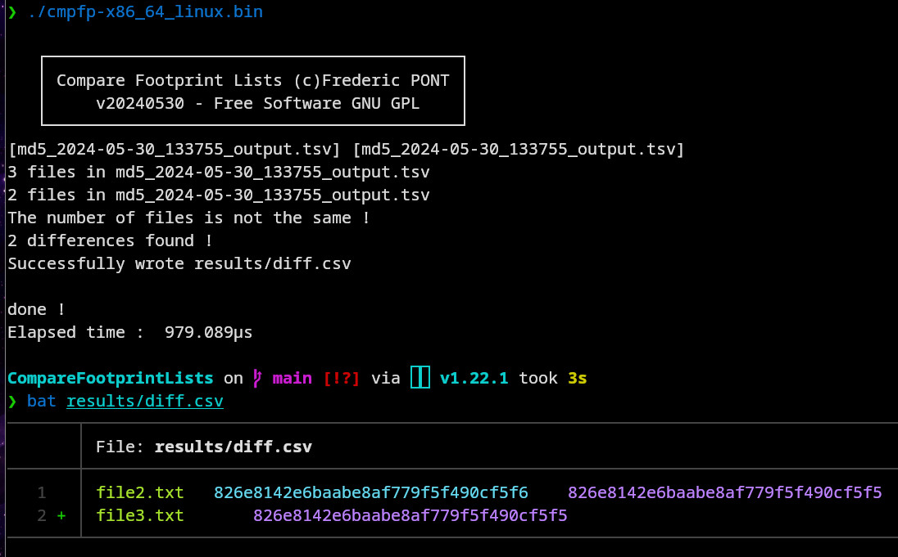

#  CompareFootprintLists
CompareFootprintLists compare two files footprint lists obtained with [File Footprint Lister](https://github.com/FredPont/FileFootprintLister)

# Quick start
- copy list A in list_A directory (TSV format - 3 columns : footprint filename path - path is not used for comparison)
- copy list B in list_B directory (TSV format - 3 columns : footprint filename path - path is not used for comparison)
- start the software in the CompareFootprintLists directory
- The number of differences found is displayed in the terminal and a differences file is produced in the result directory

If the files are identical the difference file is not produced

# Features
- Compare 2 lists of 2 columns
- Parallel comparison
- First column of the list is used as reference (file name) and the second column is used as value (file footprint)

# Todo
- take into account missing files

# ScreenShots
