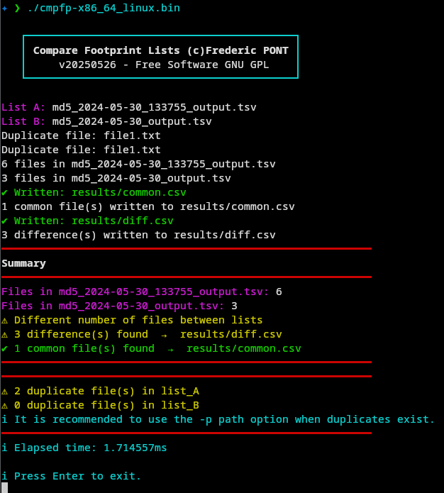

#  CompareFootprintLists
CompareFootprintLists compare two files footprint lists obtained with [File Footprint Lister](https://github.com/FredPont/FileFootprintLister)

# Quick start
Important : the comparison is based on file names, if 2 files have the same names they cannot be included in the same list.
- copy list A in list_A directory (TSV format - 3 columns : footprint filename path - path is not used for comparison)
- copy list B in list_B directory (TSV format - 3 columns : footprint filename path - path is not used for comparison)
- start the software in the CompareFootprintLists directory
- The number of differences found is displayed in the terminal and a differences file is produced in the result directory

If the files are identical the difference file is not produced

# Options
Usage :

  -p string

    Comparison by file names or path. "filename" (default) or "path".
    This option is useful if there are file duplicates whith the same name. 
    Caution, if path is used, the full file path must be the same in both lists (default "filename")

example : ./cmpfp-x86_64_linux.bin -p path

 With the option  -p path, the comparison use the file path as reference key, instead of the file name. The advantage is that duplicate file names are allowed, but the file path have to be identicals (or made identical by removing the non-constant part of the path)

# Features
- Compare 2 lists of 2 columns
- Parallel comparison
- First column of the list is used as reference (file name) by default and the second column is used as value (file footprint)
- Duplicate detection
- Duplicate file possible if the file path is used as reference key (see options)

# ScreenShots
