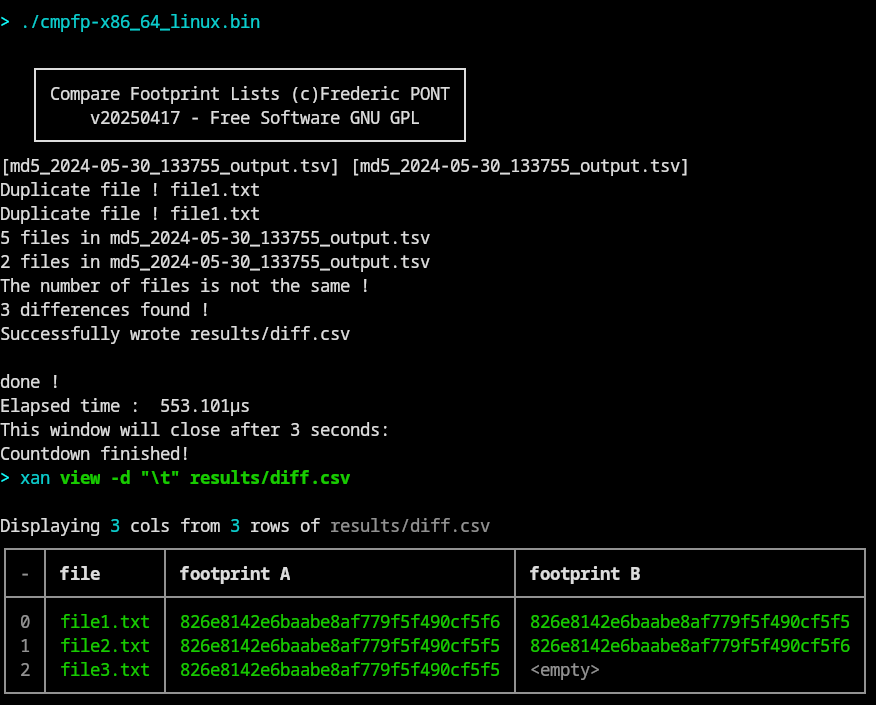
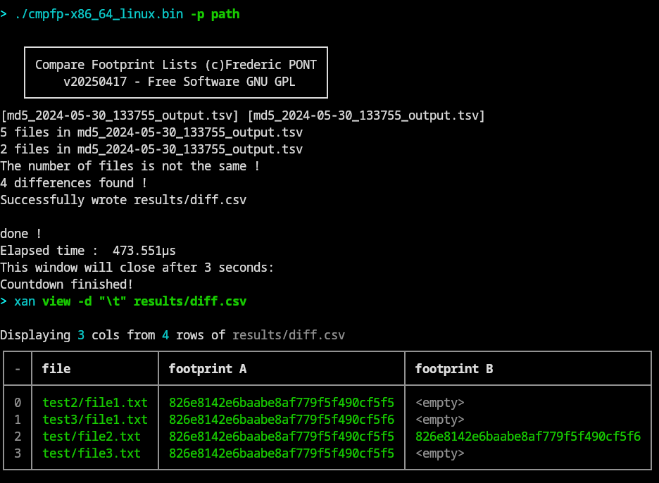

#  CompareFootprintLists
CompareFootprintLists compare two files footprint lists obtained with [File Footprint Lister](https://github.com/FredPont/FileFootprintLister)

# Quick start
Important : the comparison is based on file names by default, if 2 files have the same names, the comparison should be based on the file path (see tips).
- copy list A in list_A directory (TSV format - 3 columns : [footprint filename path] - path is not used for comparison)
- copy list B in list_B directory (TSV format - 3 columns : [footprint filename path] - path is not used for comparison)
- start the software in the CompareFootprintLists directory
- The number of differences found is displayed in the terminal and a differences file is produced in the result directory

If the files are identical the difference file is not produced. A log file "output.log" record the terminal output.

# Options
Usage :

  -p string

    Comparison by file names or path. "filename" (default) or "path".
    This option is useful if there are file duplicates whith the same name. 
    Caution, if path is used, the full file path must be the same in both lists (default "filename")

example : ./cmpfp-x86_64_linux.bin -p path

 With the option  -p path, the comparison use the file path as reference key, instead of the file name. The advantage is that duplicate file names are allowed, but the file path have to be identicals (or made identical by removing the non-constant part of the path)

# Features
- Statically compiled binary : nothing to install in the system
- Compare 2 lists of 3 columns (footprint, file name, path)
- Parallel comparison
- First column of the list is used as reference (file name) by default and the second column is used as value (file footprint)
- Duplicate detection
- Duplicate file allowed if the file path is used as reference key (see options)

# Tips
- To compare 2 lists with 2 columns (footprint, fileName or path) run the software without argument (fileName reference by default will be used in the second column)
- To compare lists with file duplicates, use <-p path> option. If necessary remove the beginning of the file path that could lead to diffences. For example :
path in list A is /home/bob/MyDir
path in list B is /home/fred/MyDir
then set path to < MyDir > in both lists 

# ScreenShots

